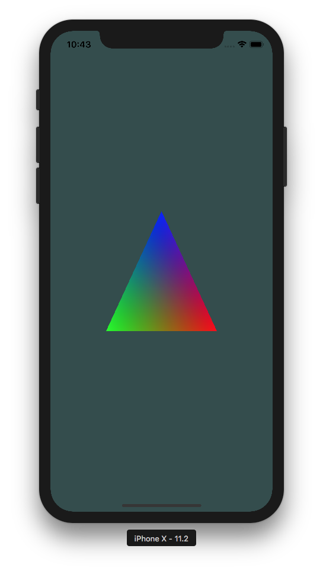

# OpenGLAprendiendo-iOS

Learning how to draw a triangle using OpenGL and GLKit on iOS

# References

## OpenGL ES 2.0

* [OpenGL ES & GLKit - raywenderlich.com](https://www.youtube.com/watch?v=VN_qGY43A1Y&list=PL23Revp-82LL_XoQEiTT6zsgHHrpjr1D9)
* [OpenGL ES Introduction - CS 4962 - Mobile Application Programming](https://www.youtube.com/watch?v=86MRLtWrCx0)
* [OpenGL ES Shaders - CS 4962 - Mobile Application Programming](https://www.youtube.com/watch?v=-dHGjvHsk0g)

## OpenGL

* [Drawing a Triangle](https://www.youtube.com/watch?v=EIpxcNl2WJU)
